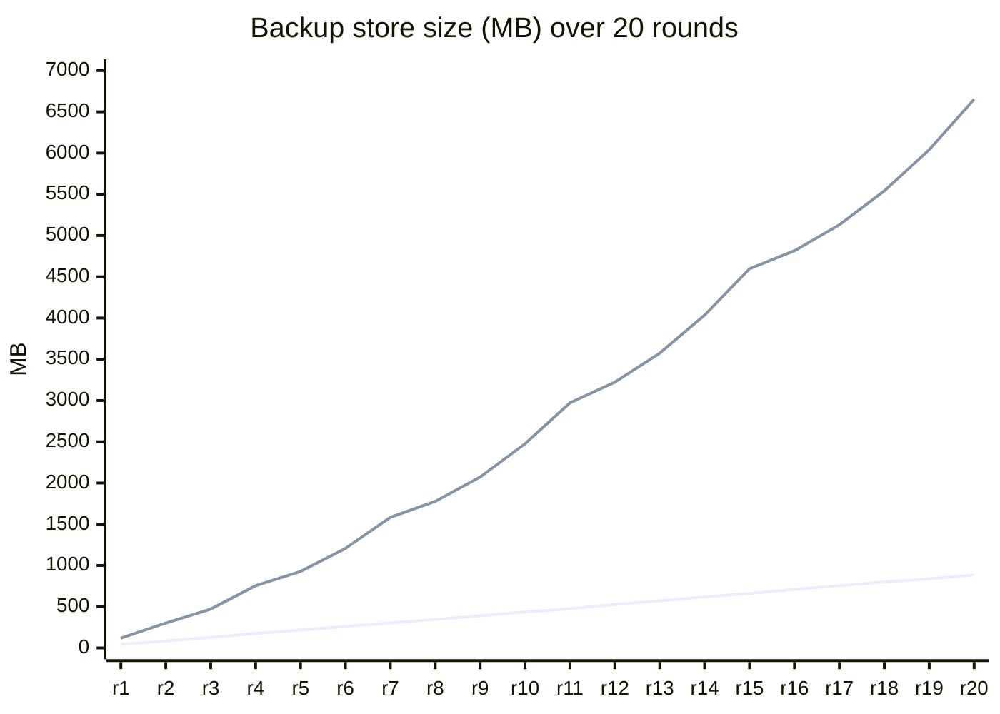

# ZRDBack - Zstd Reverse Delta Backup

ZRDBack (Zstd Reverse Delta Backup) is a server-side Fabric mod that backs up worlds in the ZVCR-3D format.
It utilises reverse deltas and Zstd compression to achieve extreme compression ratio while not hurting game performance.

Many backup mods just copies and compresses the save folder statically.
Some others, like fastback uses delta chain to reduce storage usage.
But unlike normal git repo, the region files are compressed/de-compressed every time the game saves it.
So, the delta chain is always complex, and delta compression is practically not just possible.
Furthermore, you can't keep all git commits if you are committing every hour as git tree becomes too big.
You need to prune older snapshots, but it also means you need to re-calculate delta chain every time you prune snapshots.

But ZRDBack made to be different. It uses reverse-delta instead of normal delta chain.
So pruning old snapshots is just deleting old file. Can be done in a tick.
ZRDBack also use ZVCR-3D format to save efficiently. ZVCR de-duplicates, palletizes the data.
The mod also leverages zstd compression to compress reverse-delta fast and efficiently.
Lastly, the mod de-compresses the region files to make reverse-delta calculation/compression practical.

```
zrdback
├── zvcr-java            pure-Java ZVCR-3D format library (byte-compatible)
│   ├── paletted pack/unpack (4/8/16-bit, uint64 cells, LSB-first)
│   ├── reverse delta chains + mid-chain checkpoints
│   ├── block/biome palette tables (canonical ordering, dedup)
│   ├── tile entity history (put/erase, canonical NBT)
│   ├── region container serialization + Zstd level 8 (frame checksum)
│   └── directory layout + floorDiv32 sector math
├── BackupService        header scan -> change gate -> extract -> insert -> atomic write
│                         (region files processed in parallel by nice-19 workers)
├── FileBlobStore        content-addressed blobs for non-chunk files (level.dat, players, ...)
├── WorldRestorer        reconstructs a bootable world from any timestamp
 └── /zrdback             now | prune | restore | list | stats | status
```

# Performance

Benchmarked against FastBack 0.35.0 (native git + git-lfs) on a dedicated Fabric 26.3 server,
Java 25, 20 rounds of +10k pregenerated chunks (10.2k -> 200k chunks, world 2.1 GB).


| | ZRDBack | FastBack |
|---|---|---|
| incremental backup time | 6.1-9.9 s, flat in world size | 5-6 s per round |
| store size @ 10k chunks | 43.0 MB (2.8x smaller) | 119.3 MB  |
| store size @ 200k chunks | 884 MB (7.5x smaller) | 6.65 GB  |
| growth per ~10k-chunk backup | ~38-50 MB | ~170-610 MB |

The size gap widens as history accumulates: git re-blobs every modified region file whole
(~1024 chunks worth per touched file), while ZRDBack stores per-chunk reverse deltas.
At 200k chunks, 20 restore points cost 0.43x the live world size with ZRDBack vs 3.2x with git.

Backup work runs on a fixed worker pool (default half the cores) at
minimum thread priority (nice 19 on Linux), so backups soak up idle CPU and server ticks are always served first;
measured zero tick loss on a live server.

# How it works

## Change detection

An Anvil region file starts with an 8 KiB header: 1024 chunk offsets + 1024 chunk timestamps.
ZRDBack reads only that header (8 KiB per region file, no chunk data) and
compares each chunk's timestamp against the newest timestamp
stored in the backup for that chunk.

```
chunk changed  =>  offset != 0  &&  header timestamp > chain-head timestamp
```

Unchanged chunks cost an in-memory comparison. Only changed chunks are decompressed and parsed.

## Semantic storage (ZVCR-3D)

For every changed chunk, the mod extracts:

- 24 block sections (overworld) as arrays of 4096 blockstate IDs each
- 24 biome sections as arrays of 64 biome IDs each
- the tile entity list (type ID + canonical NBT per TE)

and inserts them into the chunk's reverse-delta chain in its `.zvcr3d` file:

- The newest entry of a chain is always a full snapshot (palette-packed).
- Every older entry is a reverse delta: at each changed position it stores the
  previous value; unchanged positions store `0xFFFF`.
- Older states are reconstructed by unpacking the newest snapshot and applying deltas
  backwards until the target timestamp is reached.
- Checkpoints: every N deltas (default 32) the oldest state is materialized as a full
  snapshot, bounding reconstruction cost to O(checkpoint interval).

Everything is palette-packed (4/8/16-bit entries, LSB-first in `uint64` cells)
and the whole region container is compressed with Zstd (level 4 for incremental
backups - roughly 4x cheaper for ~1% larger files - level 8 for prune rewrites;
frame checksum always on).
Palettes are built in canonical (ascending) order so identical section content deduplicates
in the palette table.

## Non-chunk files (blob store)

Files ZVCR does not model semantically are stored in a content-addressed blob store:

- `level.dat`, `level.dat_old`
- `players/` (player data)
- `data/` (world gen settings, scoreboard, game rules, weather, ...)
- per-dimension `entities/`, `poi/`, `data/` (raids, world border, dragon fight, ...)

Each file is Zstd-compressed into `blobs/<sha256>.zst`, deduplicated by content hash,
and tracked per-file in `files-index.json` as a `{timestamp, hash}` history.
these files support time travel and pruning too.

## Atomic writes

Every backup file is written to a temp file, fsynced, atomically renamed,
and the parent directory is fsynced. A crash mid-backup never corrupts the previous backup.

## Restore

`/zrdback restore <timestamp|latest>` reconstructs a complete, bootable world into
`<output>/restore/<timestamp>/`; never into the live world. Restoring the same
timestamp again replaces the previous output.

The timestamp must fall within the recorded history (oldest...newest backup
state); older timestamps fail with the valid range instead of producing a
partial world. Chunks first recorded after the target timestamp are skipped,
vanilla regenerates them from the seed.

- Region files are rebuilt from the chains at the target timestamp (vanilla
  `PalettedContainer`s, written through vanilla `RegionFile`).
- Tile entities are rebuilt from the stored canonical NBT.
- Auxiliary files come from the blob store at the same timestamp.
- Restored chunks carry the current `DataVersion` and `isLightOn=false`;
  vanilla recomputes light and heightmaps on load.
- Only fully generated chunks are backed up (ZVCR-3D stores chunk semantics).
  Proto-chunks (structure starts, terrain in progress) are not covered.
  The restored world regenerates them on first load, which vanilla reproduces
  deterministically from the world seed. Worldgen-modifying mods may change that.

To use a restore: stop the server, delete the target world folder, then copy
the restore directory's contents into its place, start the server. Never copy
the restore output into an existing world folder (leftover region files from the
old world would mix with the restored ones), and never copy it while the server
has the world open (vanilla's exit save would overwrite it).

# Usage

## Configuration

Configuration lives under `config/zrdback.properties`

| Property | Default | Meaning |
|---|---|---|
| `output-directory` | (empty) | Backup storage root. Empty = `zrdback-backups/` next to the world save (never inside it). In singleplayer the store is scoped per save: `<root>/<world-name>/`. |
| `interval-minutes` | `60` | Minutes between automatic backups. |
| `checkpoint-interval` | `32` | Full snapshot every N deltas per chain (bounds reconstruction cost). |
| `retention-days` | `0` | Auto-prune entries older than N days after each backup. `0` = keep forever. |
| `threads` | `0` | Worker threads for backup/prune. `0` = auto (half the cores, min 1). Workers run at minimum priority so ticks are served first. |

In singleplayer the world save's parent is the shared `saves/` directory of the
whole instance, so the store root is always scoped per save
(`<output-directory or default>/<world-name>/`) - backups, prune, retention and
restore only ever touch the current save. Dedicated servers host one world per
process and keep the flat layout.

## Commands

Every backup first asks vanilla to save (`saveEverything`): chunks, `level.dat`
and player data are flushed to disk before the snapshot, so inventory, position
and recent edits are never lost to the autosave interval.

| Command | Effect |
|---|---|
| `/zrdback now` | Run an incremental backup immediately. |
| `/zrdback restore <timestamp\|latest>` | Reconstruct the world as of a unix timestamp into `<output>/restore/<timestamp>/`. |
| `/zrdback list [min-days] [max-days] [skip-nums] [keep-nums]` | List restore-point timestamps, newest first, whose age is between `min-days` and `max-days` (inclusive; `max-days` 0 = unbounded), after skipping the `skip-nums` newest; shows at most `keep-nums` (default 50). Omitted: min 0, max unbounded, skip 0. |
| `/zrdback prune <days>` | Drop chain/blob history older than N days (newest state is always kept), GC unreferenced blobs. |
| `/zrdback stats` | Chain lengths, palette dedup ratio, blob store size for tuning `checkpoint-interval`. |
| `/zrdback status` | Config summary + blob store size. |

## Backup layout

```
zrdback-backups/
├── overworld/<sectorX>/<sectorZ>/r.<regionX>.<regionZ>.zvcr3d
├── nether/...  end/...
├── blobs/<sha256>.zst          # deduplicated auxiliary files
└── files-index.json            # per-file {timestamp, hash} history
```

Region coordinates use the standard Anvil mapping; sector directories are
`floorDiv(region, 32)` (correct for negative coordinates).

## Restoring

```
/zrdback restore latest
# -> .../zrdback-backups/restore/1790683304/
```

Stop the server, replace the world folder with the contents of the restore directory,
start the server. The restored world boots like the original (verified: zero load errors,
block states and tile entities intact).

# License and credits

crayne - author of the reference ZVCR implementation
([zvcr](https://github.com/2b2tplace/zvcr) and
[zvcr_utils](https://github.com/2b2tplace/zvcr_utils)), the ZVCR-3D file format,
and the C++ tooling this mod is byte-compatible with. The format specification,
the reverse-delta design, the palette packing scheme and the directory layout
all come from the reference implementation.
This project's Java library is a faithful port of it.

This project is licensed under the GNU General Public License v3.0 or later.

The underlying ZVCR-3D format and the reference implementation (`zvcr`, `zvcr_utils`) by
crayne are licensed under the GNU Lesser General Public License v3.0. The Java format
library in this repository is a port of concepts from that LGPL-licensed reference; it is
redistributed as part of this GPL-licensed work in accordance with the LGPL.
